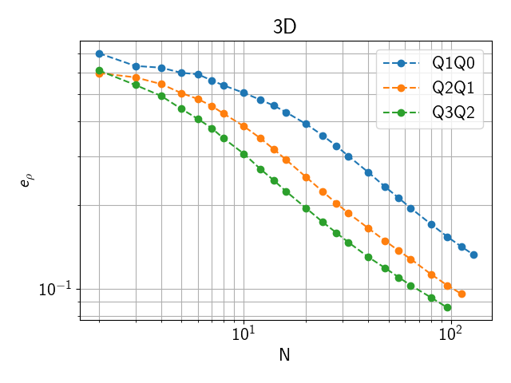
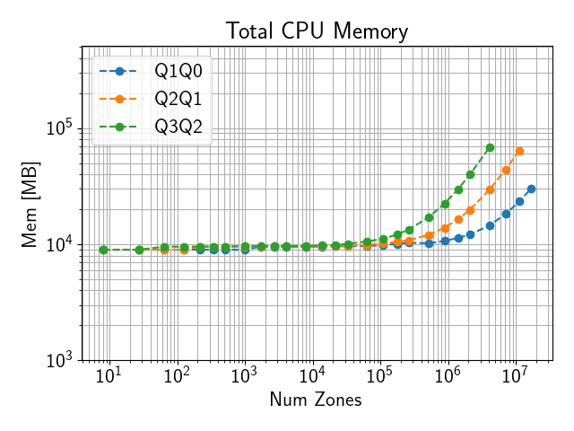
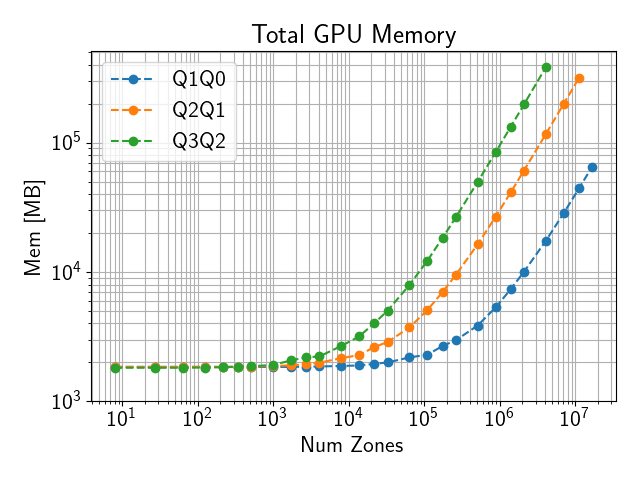
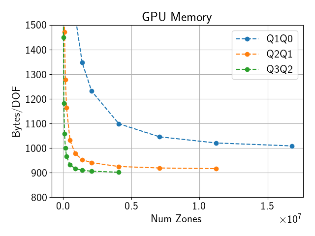

******
Laghos
******

Laghos source code is near-final at this point. The problems to run are yet to be finalized.

Purpose
=======

**Laghos** (LAGrangian High-Order Solver) is a miniapp that solves the time-dependent Euler equations of compressible gas dynamics in a moving Lagrangian frame using unstructured high-order finite element spatial discretization and explicit high-order time-stepping.
It is available at https://github.com/CEED/Laghos .
It requires an installation of Hypre, Metis, and MFEM.

Characteristics
===============

Problems
--------

The test problems are the Sedov shock (problem 1 in Laghos) in 3D.
The test problems should be run with a conforming mesh.
Linear, quadratic, and cubic orders are of interest with the following priorities:

Priority 1 problems
^^^^^^^^^^^^^^^^^^^
   #. **3D Linear** This problem uses a kinematic order of 1, and a thermodynamic order of 0 (Q1Q0).
   #. **3D Quadratic** This problem uses a kinematic order of 2, and a thermodynamic order of 1 (Q2Q1).

Priority 2 problems
^^^^^^^^^^^^^^^^^^^
   3. **3D Cubic** This problem uses a kinematic order of 3, and a thermodynamics order of 2 (Q3Q2).

The problem sizes and partitioning scheme for both problems can be set by the user from the command line. 
The kinematic order is set using the `-ok` command-line option while the thermodynamic order is set using `-ot`. 
In all cases the default quadrature integration order should be used.
See :ref:`RunningLaghos` for how to run each of the different problems.

Figure of Merit
---------------

Each time step in Laghos contains 3 major distinct computations:

1. The inversion of the global kinematic mass matrix (CG H1).
2. The force operator evaluation from degrees of freedom to quadrature points (Forces).
3. The physics kernel in quadrature points (UpdateQuadData).

Laghos is instrumented to report the total execution times and rates, in terms of millions of degrees of freedom per second (megadofs), for each of these computational phases. (The time for inversion of the local thermodynamic mass matrices (CG L2) is also reported, but that takes a small part of the overall computation.)
Rates are averaged over all RK stages taken and for the purposes of benchmarking are configured to take 100 RK4 timesteps.

Laghos also reports the total rate for these major kernels, which is the **Figure of Merit (FOM)** for benchmarking purposes.

Source code modifications
=========================

.. _LaghosModifications

Please see :ref:`GlobalRunRules` for general guidance on allowed modifications.

For Laghos we define the following restrictions on source code modifications:

* Laghos must use MFEM and Hypre as the solver library, available at https://github.com/mfem/mfem and https://github.com/hypre-space/hypre respectively. Hypre must be built with ``HYPRE_ENABLE_MIXEDINT=ON``. The final validated results must match or exceed the results of double precision accuracy shown in :ref:`ValidateLaghos`.
* Laghos and MFEM must be built using RAJA, available at https://github.com/llnl/raja . Depending on system configuration RAJA can be built in "CPU Serial" (one thread per MPI rank), "CPU OpenMP", "CUDA", or "HIP" device backends.
* The listed command line options shown in :ref:`RunningLaghos` must be used without modification. A few additional command line options may be added:

  * ``-d raja-omp`` for CPU OpenMP acceleration.
  * ``-d raja-gpu`` for GPU acceleration.
  * ``-dev`` for specifying which GPU to run on for a multi-GPU system (if not restricted by the job scheduler first).
  * ``-gam`` for GPU-aware MPI
  * ``-dev-pool-size`` for specifying an initial Umpire device memory pool size.
    
* Hypre/MFEM/Laghos may optionally be built with Umpire (https://github.com/LLNL/Umpire). The host and device memory allocators may be changed to any available allocator in MFEM.
* `LAGHOS_DEVICE_SYNC` in `laghos_solver.cpp` must not be changed to get accurate an accurate FOM.
* Code related to validating the Sedov solution must not be changed. These include `sedov_sol.hpp`, `sedov_sol.cpp`, `bisect.hpp`, `adaptive_quad.hpp`, and `err_order` in `laghos.cpp`. The Sedov solution must be computed using double precision even if Laghos is modified to run with single precision.

Building
========

Prerequisites:

* CMake 3.24.0+
* C compiler
* C++17 compiler
* MPI

These instructions install all dependencies to a user-defined ``$INSTALLDIR`` using a user-defined ``$CC`` C compiler, ``$CXX`` C++-17 compiler, ``$CUDACC`` CUDA compiler (for CUDA acceleration), and ``$HIPCC`` HIP compiler (for HIP acceleration). Both ``nvcc`` and ``clang`` are supported as the CUDA compiler.

Metis (required)
----------------

.. code-block:: console
                
                git clone https://github.com/KarypisLab/METIS.git
                cd METIS
                mkdir build
                cd build
                cmake .. -DCMAKE_BUILD_TYPE=Release -DCMAKE_C_COMPILER=$CC -DCMAKE_INSTALL_PREFIX=$INSTALLDIR
                make -j install

Umpire (optional)
-----------------

It is only recommended to use Umpire for GPU-accelerated configurations.

CUDA:

.. code-block:: console
                
                git clone https://github.com/LLNL/Umpire.git
                cd Umpire
                mkdir build
                cd build
                cmake .. -DCMAKE_BUILD_TYPE=Release -DCMAKE_CUDA_ARCHITECTURES=native -DENABLE_CUDA=ON -DUMPIRE_ENABLE_C=ON -DCMAKE_INSTALL_PREFIX=$INSTALLDIR -DCMAKE_C_COMPILER=$CC -DCMAKE_CXX_COMPILER=$CXX -DCMAKE_CUDA_COMPILER=$CUDACC
                make -j install

HIP:

.. code-block:: console
                
                git clone https://github.com/LLNL/Umpire.git
                cd Umpire
                mkdir build
                cd build
                cmake .. -DCMAKE_BUILD_TYPE=Release -DCMAKE_HIP_ARCHITECTURES=native -DENABLE_HIP=ON -DUMPIRE_ENABLE_C=ON -DCMAKE_INSTALL_PREFIX=$INSTALLDIR -DCMAKE_C_COMPILER=$CC -DCMAKE_CXX_COMPILER=$CXX -DCMAKE_HIP_COMPILER=$HIPCC
                make -j install

RAJA (required)
----------------

Serial CPU:

.. code-block:: console
                
                git clone https://github.com/LLNL/RAJA.git
                cd RAJA
                mkdir build
                cd build
                cmake .. -DCMAKE_BUILD_TYPE=Release -DCMAKE_INSTALL_PREFIX=$INSTALLDIR -DRAJA_ENABLE_EXAMPLES=Off -DRAJA_ENABLE_TESTS=Off -DCMAKE_C_COMPILER=$CC -DCMAKE_CXX_COMPILER=$CXX
                make -j install

CPU OpenMP:

.. code-block:: console
                
                git clone https://github.com/LLNL/RAJA.git
                cd RAJA
                mkdir build
                cd build
                cmake .. -DCMAKE_BUILD_TYPE=Release -DCMAKE_INSTALL_PREFIX=$INSTALLDIR -DRAJA_ENABLE_EXAMPLES=Off -DRAJA_ENABLE_TESTS=Off -DCMAKE_C_COMPILER=$CC -DCMAKE_CXX_COMPILER=$CXX -DENABLE_OPENMP=ON
                make -j install

CUDA:

.. code-block:: console
                
                git clone https://github.com/LLNL/RAJA.git
                cd RAJA
                mkdir build
                cd build
                cmake .. -DCMAKE_BUILD_TYPE=Release -DCMAKE_INSTALL_PREFIX=$INSTALLDIR -DRAJA_ENABLE_EXAMPLES=Off -DRAJA_ENABLE_TESTS=Off -DCMAKE_C_COMPILER=$CC -DCMAKE_CXX_COMPILER=$CXX -DCMAKE_CUDA_COMPILER=$CUDACC -DENABLE_CUDA=ON -DCMAKE_CUDA_ARCHITECTURES=native -DCMAKE_CXX_FLAGS="-DCAMP_USE_PLATFORM_DEFAULT_STREAM=1" -DCMAKE_CUDA_FLAGS="-DCAMP_USE_PLATFORM_DEFAULT_STREAM=1"
                make -j install

HIP:

.. code-block:: console
                
                git clone https://github.com/LLNL/RAJA.git
                cd RAJA
                mkdir build
                cd build
                cmake .. -DCMAKE_BUILD_TYPE=Release -DCMAKE_INSTALL_PREFIX=$INSTALLDIR -DRAJA_ENABLE_EXAMPLES=Off -DRAJA_ENABLE_TESTS=Off -DCMAKE_C_COMPILER=$CC -DCMAKE_CXX_COMPILER=$CXX -DCMAKE_HIP_COMPILER=$HIPCC -DENABLE_HIP=ON -DCMAKE_HIP_ARCHITECTURES=native -DROCPRIM_DIR=$ROCM_PATH -DCMAKE_CXX_FLAGS="-DCAMP_USE_PLATFORM_DEFAULT_STREAM=1" -DCMAKE_HIP_FLAGS="-DCAMP_USE_PLATFORM_DEFAULT_STREAM=1"
                make -j install

Hypre (required)
----------------

Serial CPU:

.. code-block:: console
                
                git clone https://github.com/hypre-space/hypre.git
                cd hypre/build
                cmake ../src -DCMAKE_BUILD_TYPE=Release -DHYPRE_ENABLE_MIXEDINT=ON -DCMAKE_INSTALL_PREFIX=$INSTALLDIR -DCMAKE_C_COMPILER=$CC -DCMAKE_CXX_COMPILER=$CXX
                make -j install

CPU OpenMP:

.. code-block:: console
                
                git clone https://github.com/hypre-space/hypre.git
                cd hypre/build
                cmake ../src -DCMAKE_BUILD_TYPE=Release -DHYPRE_ENABLE_MIXEDINT=ON -DCMAKE_INSTALL_PREFIX=$INSTALLDIR -DHYPRE_ENABLE_OPENMP=ON -DCMAKE_C_COMPILER=$CC -DCMAKE_CXX_COMPILER=$CXX
                make -j install

CUDA:

.. code-block:: console
                
                git clone https://github.com/hypre-space/hypre.git
                cd hypre/build
                cmake ../src -DCMAKE_BUILD_TYPE=Release -DHYPRE_ENABLE_MIXEDINT=ON -DCMAKE_INSTALL_PREFIX=$INSTALLDIR -DHYPRE_ENABLE_CUDA=ON -DCMAKE_CUDA_ARCHITECTURES=native -DCMAKE_C_COMPILER=$CC -DCMAKE_CXX_COMPILER=$CXX -DCMAKE_CUDA_COMPILER=$CUDACC -DHYPRE_ENABLE_GPU_AWARE_MPI=ON -DHYPRE_ENABLE_UMPIRE=ON
                make -j install

``HYPRE_ENABLE_GPU_AWARE_MPI`` and ``HYPRE_ENABLE_UMPIRE`` may be optionally turned off.

HIP:

.. code-block:: console
                
                git clone https://github.com/hypre-space/hypre.git
                cd hypre/build
                cmake ../src -DCMAKE_BUILD_TYPE=Release -DHYPRE_ENABLE_MIXEDINT=ON -DCMAKE_INSTALL_PREFIX=$INSTALLDIR -DHYPRE_ENABLE_HIP=ON -DCMAKE_HIP_ARCHITECTURES=native -DCMAKE_C_COMPILER=$CC -DCMAKE_CXX_COMPILER=$CXX -DCMAKE_HIP_COMPILER=$HIPCC -DHYPRE_ENABLE_GPU_AWARE_MPI=ON -DHYPRE_ENABLE_UMPIRE=ON
                make -j install

``HYPRE_ENABLE_GPU_AWARE_MPI`` and ``HYPRE_ENABLE_UMPIRE`` may be optionally turned off.

MFEM (required)
---------------

Serial CPU:

.. code-block:: console
                
                git clone https://github.com/mfem/mfem.git
                cd mfem
                mkdir build
                cd build
                cmake .. -DCMAKE_BUILD_TYPE=Release -DCMAKE_INSTALL_PREFIX=$INSTALLDIR -DHYPRE_DIR=$INSTALLDIR -DMETIS_DIR=$INSTALLDIR -DRAJA_DIR=$INSTALLDIR -DMFEM_USE_MPI=ON -DMFEM_USE_METIS=ON -DMFEM_USE_RAJA=ON -DCMAKE_CXX_COMPILER=$CXX
                make -j install

CPU OpenMP:

.. code-block:: console
                
                git clone https://github.com/mfem/mfem.git
                cd mfem
                mkdir build
                cd build
                cmake .. -DCMAKE_BUILD_TYPE=Release -DCMAKE_INSTALL_PREFIX=$INSTALLDIR -DHYPRE_DIR=$INSTALLDIR -DMETIS_DIR=$INSTALLDIR -DRAJA_DIR=$INSTALL_DIR -DMFEM_USE_MPI=ON -DMFEM_USE_METIS=ON -DMFEM_USE_RAJA=ON -DMFEM_USE_OPENMP -DCMAKE_CXX_COMPILER=$CXX
                make -j install
                
CUDA:

.. code-block:: console
                
                git clone https://github.com/mfem/mfem.git
                cd mfem
                mkdir build
                cd build
                cmake .. -DCMAKE_BUILD_TYPE=Release -DCMAKE_INSTALL_PREFIX=$INSTALLDIR -DHYPRE_DIR=$INSTALLDIR -DMETIS_DIR=$INSTALLDIR -DRAJA_DIR=$INSTALL_DIR -DMFEM_USE_MPI=ON -DMFEM_USE_METIS=ON -DMFEM_USE_CUDA=ON -DMFEM_USE_UMPIRE=ON -DMFEM_USE_RAJA=ON -DCMAKE_CUDA_ARCHITECTURES=native -DCMAKE_CXX_COMPILER=$CXX -DCMAKE_CUDA_COMPILER=$CUDACC -DUMPIRE_DIR=$INSTALLDIR
                make -j install

``MFEM_USE_UMPIRE`` may be optionally turned off.

HIP:

.. code-block:: console
                
                git clone https://github.com/mfem/mfem.git
                cd mfem
                mkdir build
                cd build
                cmake .. -DCMAKE_BUILD_TYPE=Release -DCMAKE_INSTALL_PREFIX=$INSTALLDIR -DHYPRE_DIR=$INSTALLDIR -DMETIS_DIR=$INSTALLDIR -DRAJA_DIR=$INSTALL_DIR -DMFEM_USE_MPI=ON -DMFEM_USE_METIS=ON -DMFEM_USE_HIP=ON -DMFEM_USE_UMPIRE=ON -DMFEM_USE_RAJA=ON -DCMAKE_HIP_ARCHITECTURES=native -DCMAKE_CXX_COMPILER=$CXX -DCMAKE_HIP_COMPILER=$HIPCC -DUMPIRE_DIR=$INSTALLDIR
                make -j install

``MFEM_USE_UMPIRE`` may be optionally turned off.

Laghos (required)
-----------------

Serial CPU:

.. code-block:: console
                
                git clone https://github.com/CEED/Laghos.git
                cd Laghos
                mkdir build
                cd build
                cmake .. -DCMAKE_BUILD_TYPE=Release -DCMAKE_INSTALL_PREFIX=$INSTALLDIR -DCMAKE_CXX_COMPILER=$CXX
                make -j

CPU OpenMP:
                
CUDA:

.. code-block:: console
                
                git clone https://github.com/CEED/Laghos.git
                cd Laghos
                mkdir build
                cd build
                cmake .. -DCMAKE_BUILD_TYPE=Release -DCMAKE_INSTALL_PREFIX=$INSTALLDIR -DCMAKE_CXX_COMPILER=$CXX -DCMAKE_CUDA_COMPILER=$CUDACC -DCMAKE_CUDA_ARCHITECTURES=native
                make -j

HIP:

.. code-block:: console
                
                git clone https://github.com/CEED/Laghos.git
                cd Laghos
                mkdir build
                cd build
                cmake .. -DCMAKE_BUILD_TYPE=Release -DCMAKE_INSTALL_PREFIX=$INSTALLDIR -DCMAKE_CXX_COMPILER=$CXX -DCMAKE_HIP_COMPILER=$HIPCC -DCMAKE_HIP_ARCHITECTURES=native
                make -j

.. _RunningLaghos:

Running
=======

Note: these run commands do not include any compute device/MPI configurations. See :ref:`LaghosModifications` for available options for configuring OpenMP/GPU compute.

.. code-block:: console
                
                # 3D Q1Q0
                laghos -dim 3 -p 1 -ok 1 -ot 0 -oq -1 -pa -no-nc -ms 250 -tf 100000 --mem --fom
                # 3D Q2Q1
                laghos -dim 3 -p 1 -ok 2 -ot 1 -oq -1 -pa -no-nc -ms 250 -tf 100000 --mem --fom
                # 3D Q3Q2
                laghos -dim 3 -p 1 -ok 3 -ot 2 -oq -1 -pa -no-nc -ms 250 -tf 100000 --mem --fom

TODO: problem sizes and partitioning options

.. _ValidateLaghos:

Validation
==========

Code correctness is validated by using the following tests and comparing the outputted **Energy diff**, and **Density L2 error**. These quantities must be less than or equal to the following values on CPU and GPU:

.. code-block:: console
                
                laghos -dim 3 -p 1 -ok 1 -ot 0 -oq -1 -pa -no-nc -tf 0.6 -err -rs 0 -rp 0 -nx 64 -ny 64 -nz 64
                Energy  diff: 7.61e-05
                Density L2 error: 1.95e-01
                laghos -dim 3 -p 1 -ok 2 -ot 1 -oq -1 -pa -no-nc -tf 0.6 -err -rs 0 -rp 0 -nx 64 -ny 64 -nz 64
                Energy  diff: 3.46e-06
                Density L2 error: 1.28e-01
                laghos -dim 3 -p 1 -ok 3 -ot 2 -oq -1 -pa -no-nc -tf 0.6 -err -rs 0 -rp 0 -nx 64 -ny 64 -nz 64
                Energy  diff: 8.82e-06
                Density L2 error: 1.03e-01

The **Density L2 error** for other resolutions is shown in the following plot.
                

   **Density L2 error** for an ``NxNxN`` zone domain

Example Scalability Results
===========================

TODO

Memory Usage
============

Total memory usage scales roughly proportional to the total number of DOFs.
Both CPU and GPU memory usage can be outputted using the ``--mem`` option.

This will output the memory usage as ``(max rank CPU mem)/(total CPU mem) MB, (max rank GPU mem)/(total GPU mem) MB``, where ``max rank CPU mem`` and ``max rank GPU mem`` are the maximum CPU and GPU memory usage of any single MPI rank respectively, while ``total CPU mem`` and ``total GPU mem`` are the total amount of CPU and GPU memory used by all ranks.

Sample CPU and GPU memory usage on a single El Capitan node are shown below.

   CPU memory use on El Capitan with 4 ranks on a single node

   GPU memory use on El Capitan with 4 ranks on a single node

   GPU memory use on El Capitan with 4 ranks on a single node per DOF

Strong Scaling on El Capitan
============================

Please see :ref:`ElCapitanSystemDescription` for El Capitan system description.

TODO

Weak Scaling on El Capitan
==========================

TODO

References
==========

.. [Laghos] V. Dobrev, Tz. Kolev and R. Rieben 'High-order curvilinear finite element methods for Lagrangian hydrodynamics', SIAM Journal on Scientific Computing, (34) 2012, pp. B606–B641. https://doi.org/10.1137/120864672
